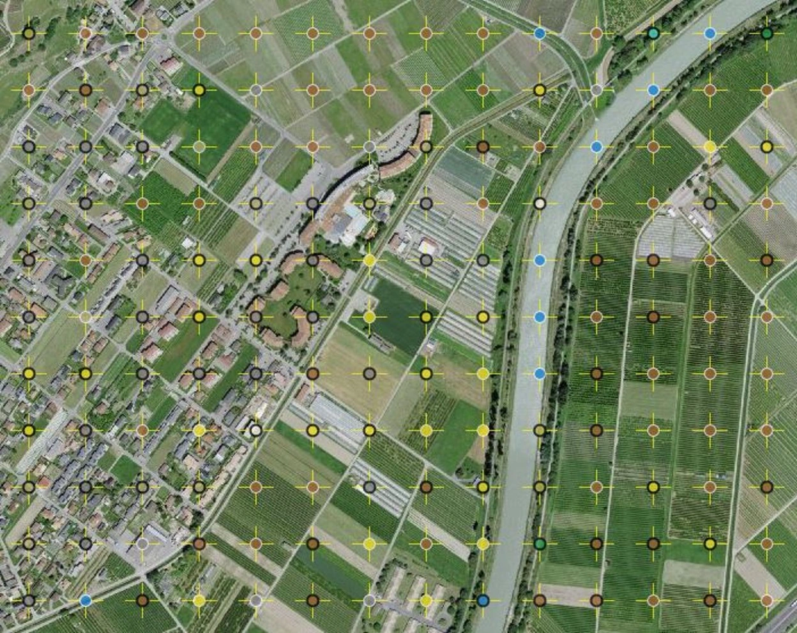
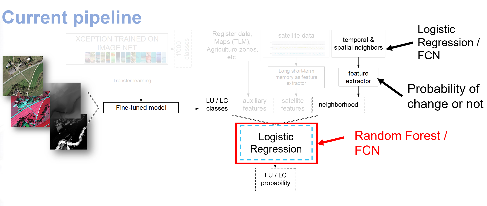

# <span style="text-transform:uppercase;"> Land cover and land usage statistics analysis of the Switzerland </span>

Shanci Li (Swisstopo) - Alessandro Cerioni (Canton of Geneva) - Gillian Milani (Federal Office for Statistics) - Roxane Pott (Swisstopo)

Proposed by the Federal Office for Statistics - PROJ-LANDSTATS <br/>
September 2022 to March 2023 - Published on April 2023

<br/>

<p align="center">
  
</p>

<center>Figure 1: Visualization of the land cover and land use classification</center>


_**Abstract**: From 2020 on, FSO started to update the land use/cover statistics over Switzerland (Arealstatistik n°5). 
To help and lessen the heavy workload of the interpretation process, partially or fully automated approaches are
envisaged. The goal of the project is to build a prototype that performs the change detection on land cover/use statistics from the data analytic perspective, which only involves the previous 
labelling records. The prototype will be integrated into the FSO pipeline to support the interpretation
process so that the work can be accelerated from 9 years to 6 years._

This repository contains the official implementation of the LANDSTATS project.

#  Get started

## Install dependencies

* If `conda` environment is available:

```bash
conda env create -f setup/environment.yaml
conda activate landstats
```

Note: Please install and configure CUDA environment according to your NVIDIA device model. For reference, this project 
uses pytorch version 1.13.0 cuda version 11.7. Here are the installation instruction for 
[Windows](https://docs.nvidia.com/cuda/cuda-installation-guide-microsoft-windows/) and 
[Linux](https://docs.nvidia.com/cuda/cuda-installation-guide-microsoft-windows/) system. 

## Data preparation
The historical record of land cover and land use had been published on the 
[OFS pages](https://map.geo.admin.ch/?lang=en&topic=ech&bgLayer=ch.swisstopo.pixelkarte-farbe&layers=ch.bfs.arealstatistik,ch.bfs.arealstatistik-bodenbedeckung&layers_opacity=0.75,0.75&layers_timestamp=2018,2018&E=2640996.17&N=1188220.63&zoom=2&layers_visibility=true,false).
In this project, we use the csv file provided by the OFS team as initial dataset. OFS had selected part of the data for 
the study which is labeled with 'training' column. The data folder structure is in [File Structure](#file-structure). 
Please download all the files and keep the structure as listed.

You can download the dataset with this link and here is the detailed explanation for the meaning of columns in csv files:

| Column         | Description                                                                                                                                                             |
|----------------|:------------------------------------------------------------------------------------------------------------------------------------------------------------------------|
| `RELI`         | 8-digit number composed of the EAST hectare number concatenated with the NORTH hectare number.                                                                          |
| `EAST`         | EAST coordinates (EPSG 2056)                                                                                                                                            |
| `NORTH`        | NORTH coordinates (EPSG 2056)                                                                                                                                           |
| `LUJ`          | Land Use label for survey J.                                                                                                                                            |
| `LCJ`          | Land Cover label for survey J.                                                                                                                                          |
| `training`     | Value 0 or 1. A value of 1 means that the point can be included in the training or validation set. Points with zero values can be used as neighbors for surveys 1 to 3. |
| `prediction`   | Prediction from the image-level, the output from CNN with historical image as input.                                                                                    |
| `confidence`   | Confidence of image-level prediction                                                                                                                                    |
| `11`~`64`      | Confidence for multi-class classification for each label                                                                                                                |

_example for RELI:
A tile with EAST and NORTH coordinate 2742200 (x7422xx) and 1222800 (x2228xx) respectively. Then the unique ID RELI for 
this tile is 74222228._

## File Structure

```
├── img                                             # img assets
├── data                                            # dataset folder
    ├── ConvRNN                                     # dataset for ConvRNN
        ├── train                                   # train set for ConvRNN
        ├── val                                     # validation set for ConvRNN
        └── test                                    # test set for ConvRNN
    ├── stdl_cross.csv                              # given dataset with 4 neighbors  
    ├── stdl_square.csv                             # given dataset with 8 neighbors
    ├── arealstatistik_all_points_only_classes.csv  # dataset with all tiles across the Switzerland 
    ├── predictions_lc_area4.csv                    # image-level prediction for land cover 
    └── predictions_lu_area4.csv                    # image-level prediction for land use  
├── metric                                          # defined metric from Federal Office for Statistics
├── models                                          # model weights for demo testing
├── scripts
    ├── ConvRNN                                     # all scripts related to the implementation of ConvRNN
        ├── convRNN.py                              # script to train the ConvRNN 
        ├── convRNN-test.py                         # script to test the ConvRNN
        ├── functional.py                           # function and decorators for ConvRNN framework 
        ├── module.py                               # implementation of Conv1d/2d/3d + RNN/LSTM/GRU
        └── utlis.py                                # utilization function 
    ├── Abalation_image-level.ipynb                 # test the defined metric performance (multi mode) with image-level prediction only
    ├── Data_preparation.ipynb                      # script to split given training set and generate the input data
    ├── EDA.ipynb                                   # Exploratory Data Analysis (interactive visualization)
    ├── evaluation-integrate-module.ipynb           # script to evaluate integration module 
    ├── evaluation-t&s-module.ipynb                 # script to evaluate temporal and spatial module 
    ├── Integrate-training-RF.ipynb                 # script to train the Random Forest model for integration module 
    ├── Integration-training-FCN.py                 # script to train FCN model for integration module 
    ├── Logistics_regression.ipynb                  # Logistic Regression model for temporal and spatial module 
    ├── temporal_spatial_RF&XGBoost.ipynb           # RandomForest&XGBoost model for temporal and spatial module
    ├── temporal_spatial_FCN.py                     # script to train FCN model for temporal and spatial module
    └── utils.py                                    # utilities classes and functions
└── setup                                           # utility to setup the environment
```

# Code Instruction 

<p align="center">
  
</p>

Above image demonstrates the workflow of the project. The first part is the temporal-spatial module on the top right. 
This module explored the performance of Logistic Regression / Random Forest / XGBoost / Fully Connected Network (FCN) / 
ConvRNN with the information from neighbour tiles. At the end of this part, we extracted the probability to change from 
the temporal-spatial module as features for next step. The second part is the integration module at the center, which 
combines the output from all kinds of modules with different source data. After that, the performance improvement from 
neighbor information was studied on the basis of the image level prediction (left part of the image).

_image-level prediction: uses current and historical aerial image to predict the land cover/land use classes of the 
input tile. The output contains both prediction and confidence for multi-class classification._

1. The first step of the project is to rearrange the dataset with `Data_preparation.ipynb`.
2. The Exploratory Data Analysis is implemented by `EDA.ipynb`.
3. 3 of 4 models for the temporal-spatial module is trained by `Logistics_regression.ipynb`, 
`temporal_spatial_RF&XGBoost.ipynb` and `temporal_spatial_FCN.py` (for FCN) and evaluated by `evaluation-t&s-module.ipynb`.
4. The last model for the temporal-spatial module is ConvRNN. It is implemented in `ConvRNN` folder, trained by 
`convRNN.py` and tested by `convRNN-test.py`.
5. When it comes to the temporal-spatial module, the model should be applied to train, validation and test set 
respectively. Once the model is fine-tuned, the probability to change would be extracted to a temporary file for later 
stages in the same script. Here we only implement the feature extraction for `Logistic Regression` and `FCN`, since they
have better performance.
6. The integration module is trained by `Integrate-training-RF.ipynb` and `Integration-training-FCN.py `. For this module, 
only Random Forest and FCN are studied so far.  
7. The integration module is evaluated by `evaluation-integrate-module.ipynb`.
8. Abalation study of using image-level data only is shown in `Abalation_image-level.ipynb`.

## Model Fine-tuning 

### Logistics Regression
 Since 5-fold cross validation is applied with the model, the hyperparameter to finetune for this model are `solver`, 
 `max-iter`, `class_weight`, `scoring`, `penalty` and `Cs`. For the details explanation, see the official 
 [documentation](https://scikit-learn.org/stable/modules/generated/sklearn.linear_model.LogisticRegressionCV.html).

Grid search is used for fine-tuning this model. _**Macro F1-score**_, _**Accuracy**_ and _**Balanced Accuracy**_ had 
been used as scoring function during fine-turing, while the model trained with **Balanced Accuracy** got the best in 
the defined metric provided from the OFS team.

### Random Forest & XGBoost

For Tree model like Random Forest and XGBoost, [Optuna](https://optuna.org/) is applied in this project to find the 
optimal tree structure and optimizer configuration parameters. The range of the hyperparameter is set before the 
optimization and Optuna will seek for the best composition of these parameters.

**Note:** Please check the best parameters and make sure they do not hit the boundary of the preset range. Otherwise, 
the model might not reach its best performance regarding the limit on choosing that specific parameter.

_p.s. XGBoost can be accelerated by GPU resource, and it is the default configuration in the code. If you do not have 
NVIDIA GPU devices, the code can run with deactivation of the `tree_method` and `gpu_id`._

### FCN & ConvRNN

For neural network model in this project, focal loss is selected as the loss function. Regarding the hyperparameter 
`\gamma` has great influence with the learning rate. It is necessary to change the initial learning rate the milestone 
epoch for the learning rate scheduler to work for different configuration of `\gamma`. The configuration can be changed 
with the following arguments:

```
python script/temporal_spatial_FCN.py --alpha 0.95 --gamma 3 --lr 2e-6 --milestones 30 60 90
```

For integration model training, we need to choose the temporal-spatial module and clarify where the extracted 
features are stored. If you save those file in `scripts/temp_results/` folder with file names as 
`temporal_spatial_proba_lr.pkl` and `temporal_spatial_proba_FCN.pkl` for logistic regression and FCN respectively, the 
arguments `base_path` can be omitted. 

```
python script/Integration-training-FCN.py --base lr --alpha 0.95 --gamma 3 --lr 2e-6 --milestones 30 60 90
python script/Integration-training-FCN.py --base fcn --alpha 0.95 --gamma 3 --lr 2e-6 --milestones 30 60 90
```

Otherwise, the following command should be used:

```
python script/Integration-training-FCN.py --base_path PATH_OF_FILE --alpha 0.95 --gamma 3 --lr 2e-6 --milestones 30 60 90
```


# Reference 

The implementation of ConvRNN has referred the project https://github.com/kamo-naoyuki/pytorch_convolutional_rnn.
